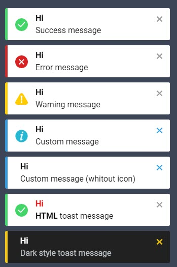

# javascript-toast-plugin
Simple and light javascript toast notification plugin




## DEMO
[More sample code and demos](https://mehrabsha.github.io/javascript-toast-plugin/Demo/)

## Usage
```html
<html>
    <head>
        <link rel="stylesheet" type="text/css" href="toastStyle.min.css">
    </head>
    <body>
        
        <script src="toast.min.js"></script>
    </body>
</html>
```

## Functions

| Function | Required | Description | Parameters |
| ----------- | --------| --------| --------|
| toast | `Yes` | `Call this function to display the toast notification` | [LINK](#toast) |
| init | `Optional` | `Call this function to set some settings , like position & fade in(out) duration & ...` | [LINK](#init) | 


```diff
- Remember that all arguments are lowercase
```


## toast()

| Parameters | Type | Default | Description |
| ----------- | --------| --------| --------|
| title | `String` | `Hi` | `Toast notification title` | 
| description | `String` | `Life is short. Live passionately.` | `Toast notification description` |
| timeout | `Int (ms)` | `0` | `set timeout for message ( 0 and null = Message without time limit)` <br/><br/> **`* in millisecond`** |
| type | `String` [ `success` , `error` , `warning` , `custom` ] | `success` | `Set notification type` |
| color | `String` | `#fff` | `Set toast notification background color` |
| close_color | `String` | `#999` | `Set toast notification close icon color` |

### sample code
```javascript
toast({ 
    title : 'Hi' , 
    description : 'Success message' ,
    type : 'success' ,
    timeout : 0
});
```


## toast() &#x1F538; custom type &#x1F538;

| Parameters | Type | Default | Description |
| ----------- | --------| --------| --------|
| border_color | `String` | `#43d569` | `Set toast notification border color` | 
| icon | `String` | `none` | `Set toast notification icon` |
| radius | `Int` | `3` | `Set border radius` |

### sample code
```javascript
toast({
    title:'Hi' ,
    description: 'Custom message' ,
    timeout : 0 ,
    type : 'custom' ,
    close_color: '#3498db' ,
    border_color: '#3498db' ,
    icon : 'url(https://img.icons8.com/flat_round/2x/info.png)'
});
```


## init()

| Parameters | Type | Default | Description |
| ----------- | --------| --------| --------|
| fade_in | `int (ms)` | `800` | `Set fade in duration` <br/><br/> **`* in millisecond`**  | 
| fade_out | `int (ms)` | `800` | `Set fade out duration` <br/><br/> **`* in millisecond`** |
| position | `String` <br/> [ `top-left` , `top-center` , `top-right` ,  `bottom-left` , `bottom-center` , `bottom-right`  ] | `bottom-left` | `Set toast notification position` |

### sample code
```javascript
init({
    fade_in : 1000 ,
    fade_out : 1000 ,
    position : 'top_left'
});
```

### [More sample code and demos](https://mehrabsha.github.io/javascript-toast-plugin/Demo/)
